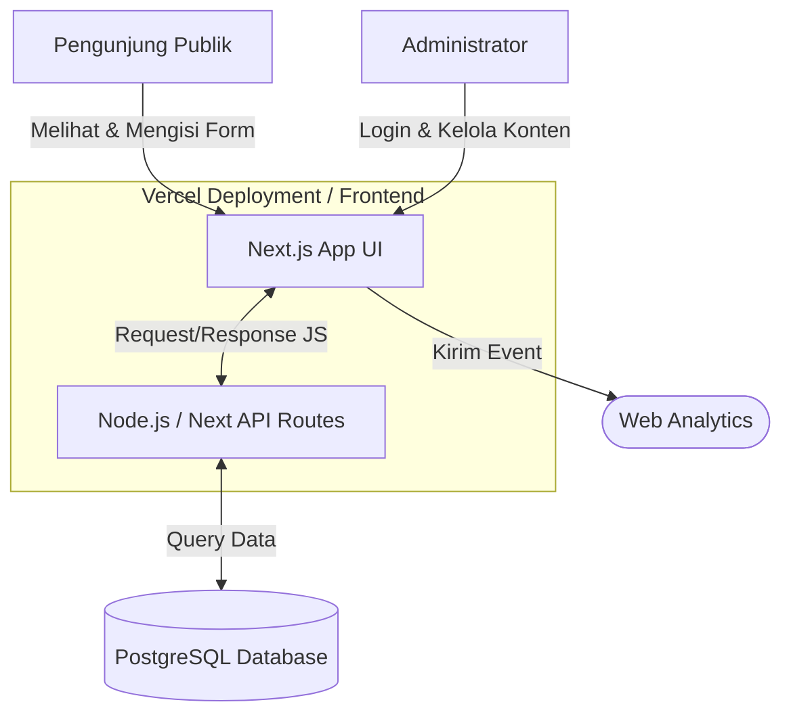
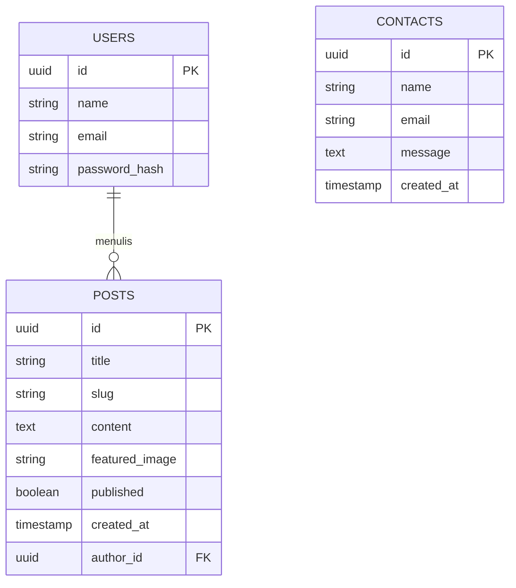

# PRD — Project Requirements Document

## 1. Overview
Proyek ini adalah pengembangan ulang (redevelopment) dari website *Company Profile* Serasi Nusa (https://www.serasinusa.id/). Tujuan utamanya adalah mempertahankan struktur, tampilan, dan nuansa website aslinya secara persis, namun melakukan perombakan total pada sisi teknologi (di belakang layar) menggunakan teknologi web modern paling mutakhir. Masalah utama yang ingin diselesaikan adalah memberikan kemudahan bagi manajemen untuk membuat, mengedit, dan mempublikasikan artikel blog atau berita melalui Panel Admin khusus, serta memastikan website lebih cepat, aman, dan ramah mesin pencari (SEO).

## 2. Requirements
- **Desain & UI/UX:** Harus merupakan replika ("semirip mungkin") dengan struktur website Serasi Nusa saat ini.
- **Akses Publik:** Website dapat diakses oleh pengunjung umum tanpa perlu melakukan registrasi atau login.
- **Panel Admin:** Tersedia sistem manajemen konten (CMS) khusus dan privat untuk mengelola blog dan berita.
- **Performa & SEO:** Menggunakan teknologi *Server-Side Rendering* (SSR) agar loading halaman sangat cepat dan mudah diindeks oleh Google.
- **Pelacakan (Tracking):** Integrasi dengan sistem analitik (seperti Google Analytics atau Vercel Analytics) untuk melacak jumlah pengunjung dan interaksi di website.
- **Pengumpulan Data:** Formulir kontak yang berfungsi penuh untuk menerima pesan dari calon klien atau pelanggan.

## 3. Core Features
**Fitur untuk Pengunjung Publik:**
- **Halaman Utama & Profil Perusahaan:** Menampilkan informasi perusahaan, layanan, dan portofolio sesuai struktur asli.
- **Halaman Berita & Blog:** Daftar artikel yang bisa dibaca oleh pengunjung, dilengkapi dengan fitur pencarian atau kategori sederhana.
- **Formulir Kontak:** Halaman bagi pengunjung untuk mengirimkan pesan, email, atau pertanyaan kepada perusahaan.

**Fitur untuk Administrator (Panel Admin):**
- **Autentikasi Aman:** Halaman login khusus dengan email dan password untuk masuk ke dashboard admin.
- **Manajemen Artikel (CRUD):** Fitur untuk membuat (Create), membaca/melihat (Read), mengubah (Update), dan menghapus (Delete) berita atau blog. Dilengkapi dengan *Teks Editor/WYSIWYG* modern yang mudah digunakan (seperti mengetik di Microsoft Word).
- **Kotak Masuk Pesan:** Menu untuk melihat daftar pesan yang dikirim oleh pengunjung melalui Formulir Kontak.

## 4. User Flow
**Alur Pengunjung Umum (Public Flow):**
1. Pengunjung membuka website.
2. Pengunjung membaca informasi profil perusahaan di Halaman Utama.
3. Pengunjung menavigasi ke halaman Blog/Berita untuk membaca update terbaru.
4. Pengunjung tertarik dan masuk ke halaman Kontak, mengisi formulir (Nama, Email, Pesan), dan menekan tombol kirim.
5. Pengunjung melihat notifikasi "Pesan berhasil dikirim" dan kembali ke aktivitas mereka.

**Alur Administrator (Admin Flow):**
1. Admin membuka URL khusus (contoh: `/admin`).
2. Admin memasukkan kredensial login.
3. Admin masuk ke Dashboard Utama untuk melihat ringkasan (jumlah pesan, jumlah artikel).
4. Admin masuk ke menu "Blog/Berita", menekan tombol "Tulis Artikel Baru".
5. Admin memasukkan Judul, Gambar Cover, dan Isi Artikel, lalu menekan "Publikasikan".
6. Admin membuka menu "Pesan Kontak" untuk membaca pesan masuk dari pengunjung.

## 5. Architecture
Sistem ini menggunakan arsitektur modern berbasis *Client-Server*, di mana Frontend (Next.js) bertugas menampilkan antarmuka yang cepat berkat *Server-Side Rendering*. Bagian *Backend API* (Node.js) akan memproses permintaan data dan menyimpannya secara aman ke dalam basis data PostgreSQL. Seluruh aplikasi akan di-*hosting* di atas infrastruktur Vercel untuk menjamin kecepatan akses global.

## 6. Database Schema
Untuk menjalankan fitur-fitur yang dibutuhkan, basis data (Database) disederhanakan menjadi 3 tabel utama:

**1. Tabel `users` (Admin)**
Tabel ini digunakan untuk menyimpan data administrator yang boleh masuk ke dalam Panel Admin.
- `id` (UUID): Identitas unik pengguna.
- `name` (String): Nama lengkap admin.
- `email` (String): Email untuk login admin.
- `password_hash` (String): Kata sandi admin yang sudah dienkripsi.

**2. Tabel `posts` (Artikel Berita/Blog)**
Tabel ini digunakan untuk menyimpan semua konten artikel yang dibuat melalui Panel Admin.
- `id` (UUID): Identitas unik artikel.
- `title` (String): Judul artikel blog/berita.
- `slug` (String): URL ramah pengguna berdasarkan judul (contoh: `judul-artikel-baru`).
- `content` (Text): Isi lengkap dari artikel (mendukung format HTML/Rich Text).
- `featured_image` (String): URL gambar sampul (cover) dari artikel.
- `published` (Boolean): Status apakah artikel ini sudah tayang atau masih di-draft.
- `author_id` (UUID): ID Admin yang menulis artikel ini (berelasi ke tabel `users`).
- `created_at` (Timestamp): Waktu artikel dibuat.

**3. Tabel `contacts` (Pesan Pengunjung)**
Tabel ini menampung semua pesan yang dikirimkan pengunjung lewat Formulir Kontak.
- `id` (UUID): Identitas unik pesan.
- `name` (String): Nama pengirim pesan.
- `email` (String): Email pengirim pesan.
- `message` (Text): Isi dari pesan/pertanyaan.
- `created_at` (Timestamp): Waktu pesan dikirimkan.

## 7. Tech Stack
Berdasarkan permintaan untuk menggunakan teknologi modern yang paling mutakhir, berikut adalah spesifikasi teknologi proyek ini:
- **Frontend & Routing:** Next.js (App Router) — Memberikan performa website yang super cepat, SEO terbaik (SSR/SSG), dan standar industri modern.
- **Styling UI:** Tailwind CSS & shadcn/ui — Membantu membangun desain (UI) yang identik dengan website asli secara cepat, responsif, dan terlihat profesional.
- **Backend API:** Node.js (Terintegrasi menggunakan Next.js Route Handlers) — Menangani logika bisnis, keamanan (Autentikasi), dan jembatan ke database.
- **Database:** PostgreSQL — Basis data relasional (SQL) yang sangat tangguh, fleksibel, dan sangat cocok untuk aplikasi skala menengah ke atas.
- **ORM (Object-Relational Mapping):** Prisma ORM atau Drizzle ORM — Mempermudah sistem backend dalam membaca dan menulis data ke tabel PostgreSQL secara aman.
- **Deployment & Hosting:** Vercel — *Platform as a Service* (PaaS) paling dioptimalkan untuk Next.js, menawarkan *deployment* otomatis dan kecepatan jaringan global.
- **Analytics:** Vercel Analytics atau Google Analytics — Mengukur performa dan trafik website secara gratis dan *seamless*.