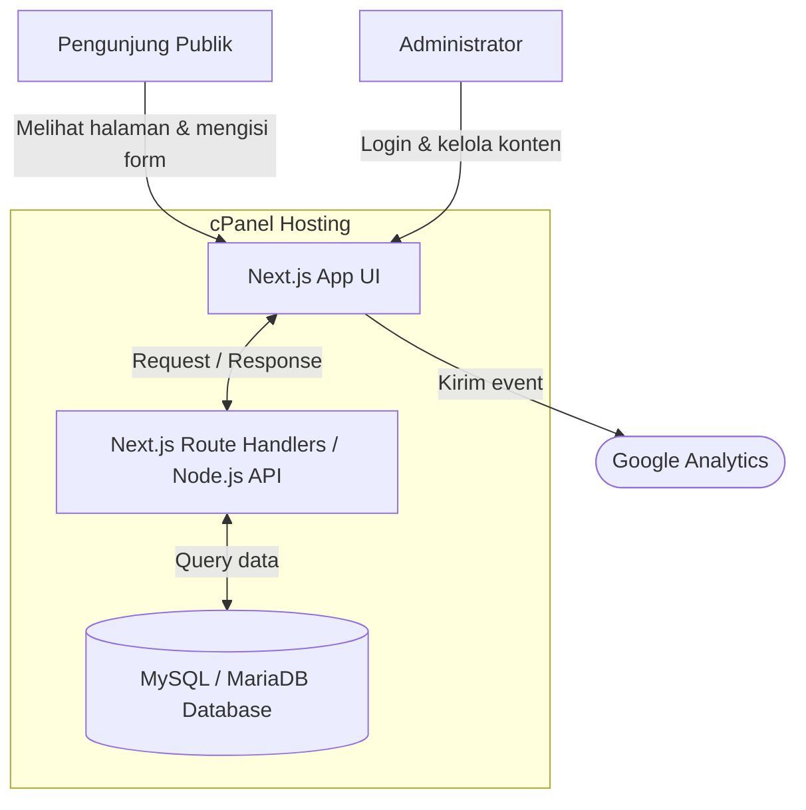
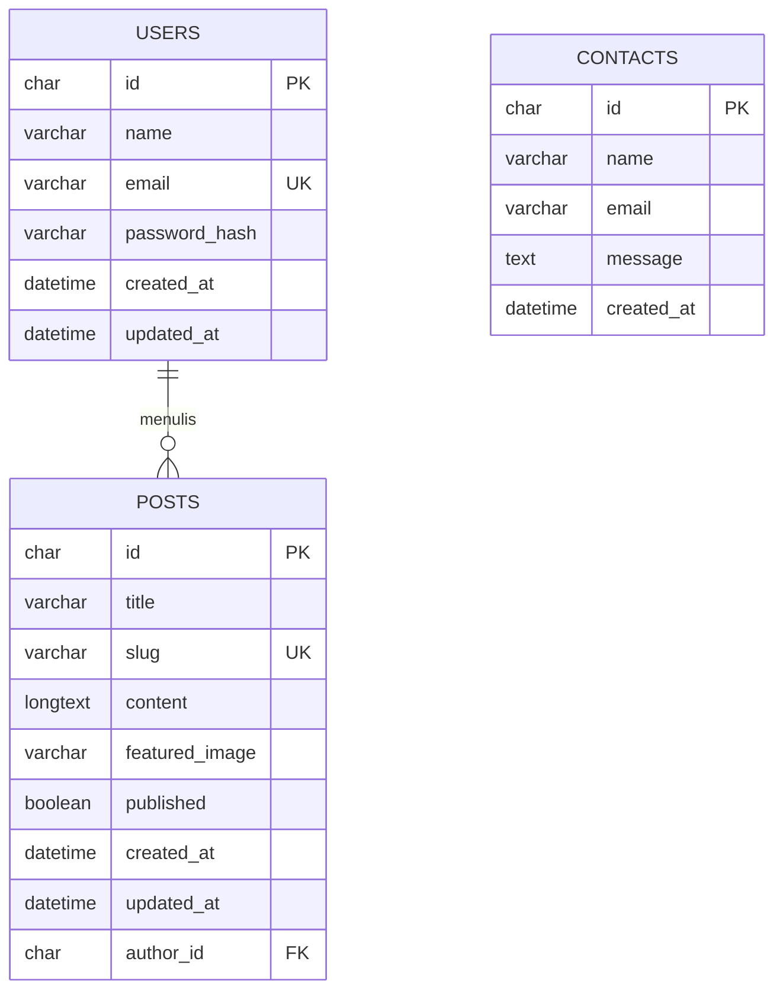

# PRD - Project Requirements Document

## 1. Overview
Proyek ini adalah pengembangan ulang (redevelopment) dari website Company Profile Serasi Nusa (https://www.serasinusa.id/). Tujuan utamanya adalah mempertahankan struktur, tampilan, dan nuansa website aslinya secara semirip mungkin, namun melakukan perombakan total pada sisi teknologi menggunakan stack web modern.

Masalah utama yang ingin diselesaikan adalah memberikan kemudahan bagi manajemen untuk membuat, mengedit, dan mempublikasikan artikel blog atau berita melalui Panel Admin khusus, menerima pesan dari formulir kontak, serta memastikan website lebih cepat, aman, dan ramah mesin pencari (SEO).

Target hosting proyek disesuaikan dengan kebutuhan operasional saat ini, yaitu cPanel hosting. Karena itu database utama yang digunakan adalah MySQL/MariaDB yang tersedia di cPanel.

## 2. Requirements
- **Desain & UI/UX:** Harus merupakan replika semirip mungkin dengan struktur website Serasi Nusa saat ini.
- **Akses Publik:** Website dapat diakses oleh pengunjung umum tanpa perlu melakukan registrasi atau login.
- **Panel Admin:** Tersedia sistem manajemen konten (CMS) khusus dan privat untuk mengelola blog dan berita.
- **Performa & SEO:** Menggunakan Next.js dengan Server-Side Rendering (SSR) atau Static Site Generation (SSG) sesuai kebutuhan halaman.
- **Pelacakan (Tracking):** Integrasi dengan Google Analytics atau layanan analitik lain yang kompatibel dengan cPanel.
- **Pengumpulan Data:** Formulir kontak yang berfungsi penuh untuk menerima pesan dari calon klien atau pengunjung.
- **Kompatibilitas Hosting:** Aplikasi harus dapat dijalankan pada cPanel yang mendukung Node.js App dengan Node.js versi minimal 20.9.0.

## 3. Core Features
**Fitur untuk Pengunjung Publik:**
- **Halaman Utama & Profil Perusahaan:** Menampilkan informasi perusahaan, layanan, dan portofolio sesuai struktur asli.
- **Halaman Berita & Blog:** Daftar artikel yang bisa dibaca oleh pengunjung, dilengkapi dengan fitur pencarian atau kategori sederhana.
- **Formulir Kontak:** Halaman bagi pengunjung untuk mengirimkan pesan, email, atau pertanyaan kepada perusahaan.

**Fitur untuk Administrator (Panel Admin):**
- **Autentikasi Aman:** Halaman login khusus dengan email dan password untuk masuk ke dashboard admin.
- **Manajemen Artikel (CRUD):** Fitur untuk membuat, membaca, mengubah, dan menghapus berita atau blog. Dilengkapi dengan teks editor/WYSIWYG modern.
- **Kotak Masuk Pesan:** Menu untuk melihat daftar pesan yang dikirim oleh pengunjung melalui formulir kontak.

## 4. User Flow
**Alur Pengunjung Umum (Public Flow):**
1. Pengunjung membuka website.
2. Pengunjung membaca informasi profil perusahaan di halaman utama.
3. Pengunjung menavigasi ke halaman Blog/Berita untuk membaca update terbaru.
4. Pengunjung masuk ke halaman Kontak, mengisi formulir nama, email, dan pesan, lalu menekan tombol kirim.
5. Pengunjung melihat notifikasi "Pesan berhasil dikirim".

**Alur Administrator (Admin Flow):**
1. Admin membuka URL khusus, misalnya `/admin`.
2. Admin memasukkan kredensial login.
3. Admin masuk ke dashboard utama untuk melihat ringkasan jumlah pesan dan jumlah artikel.
4. Admin masuk ke menu Blog/Berita, lalu menekan tombol "Tulis Artikel Baru".
5. Admin memasukkan judul, gambar cover, dan isi artikel, lalu menekan "Publikasikan".
6. Admin membuka menu Pesan Kontak untuk membaca pesan masuk dari pengunjung.

## 5. Architecture
Sistem ini menggunakan arsitektur modern berbasis Client-Server. Frontend menggunakan Next.js untuk menampilkan antarmuka yang cepat dan SEO-friendly. Backend API menggunakan Next.js Route Handlers atau server action yang berjalan pada runtime Node.js. Data artikel, akun admin, dan pesan kontak disimpan di database MySQL/MariaDB yang dibuat melalui cPanel.

Deployment utama ditargetkan ke cPanel hosting yang mendukung Node.js App. Jika paket cPanel yang digunakan tidak mendukung Node.js versi minimal 20.9.0, proyek perlu dipindahkan ke hosting Node.js yang kompatibel atau dibuat sebagai static export hanya untuk fitur publik tanpa panel admin dan database dinamis.

## 6. Database Schema
Untuk menjalankan fitur-fitur yang dibutuhkan, basis data disederhanakan menjadi 3 tabel utama. Tipe data disesuaikan untuk MySQL/MariaDB cPanel.

**1. Tabel `users` (Admin)**
Tabel ini digunakan untuk menyimpan data administrator yang boleh masuk ke Panel Admin.
- `id` (CHAR(36)): Identitas unik pengguna dalam format UUID.
- `name` (VARCHAR(150)): Nama lengkap admin.
- `email` (VARCHAR(191)): Email untuk login admin dan harus unik.
- `password_hash` (VARCHAR(255)): Kata sandi admin yang sudah dienkripsi.
- `created_at` (DATETIME): Waktu akun dibuat.
- `updated_at` (DATETIME): Waktu akun terakhir diperbarui.

**2. Tabel `posts` (Artikel Berita/Blog)**
Tabel ini digunakan untuk menyimpan semua konten artikel yang dibuat melalui Panel Admin.
- `id` (CHAR(36)): Identitas unik artikel dalam format UUID.
- `title` (VARCHAR(255)): Judul artikel blog/berita.
- `slug` (VARCHAR(255)): URL ramah pengguna berdasarkan judul, misalnya `judul-artikel-baru`, dan harus unik.
- `content` (LONGTEXT): Isi lengkap artikel, mendukung HTML/Rich Text.
- `featured_image` (VARCHAR(500), nullable): URL gambar sampul artikel.
- `published` (TINYINT(1)): Status apakah artikel sudah tayang atau masih draft.
- `author_id` (CHAR(36)): ID admin yang menulis artikel, berelasi ke tabel `users`.
- `created_at` (DATETIME): Waktu artikel dibuat.
- `updated_at` (DATETIME): Waktu artikel terakhir diperbarui.

**3. Tabel `contacts` (Pesan Pengunjung)**
Tabel ini menampung semua pesan yang dikirimkan pengunjung lewat formulir kontak.
- `id` (CHAR(36)): Identitas unik pesan dalam format UUID.
- `name` (VARCHAR(150)): Nama pengirim pesan.
- `email` (VARCHAR(191)): Email pengirim pesan.
- `message` (TEXT): Isi pesan atau pertanyaan.
- `created_at` (DATETIME): Waktu pesan dikirimkan.

## 7. Tech Stack
Berdasarkan target cPanel hosting, berikut spesifikasi teknologi proyek:
- **Frontend & Routing:** Next.js App Router - Memberikan performa website yang cepat, SEO baik, dan struktur routing modern.
- **Styling UI:** Tailwind CSS dan shadcn/ui - Membantu membangun desain yang responsif dan profesional.
- **Backend API:** Node.js melalui Next.js Route Handlers - Menangani logika bisnis, autentikasi, pengelolaan artikel, dan formulir kontak.
- **Database:** MySQL/MariaDB cPanel - Database relasional yang umum tersedia di paket hosting cPanel dan bisa dikelola melalui phpMyAdmin.
- **ORM:** Prisma ORM atau Drizzle ORM dengan konfigurasi MySQL - Mempermudah backend membaca dan menulis data ke MySQL/MariaDB secara aman.
- **Deployment & Hosting:** cPanel Node.js App - Aplikasi dijalankan sebagai server Node.js. Wajib memastikan Node.js minimal versi 20.9.0.
- **Analytics:** Google Analytics - Mengukur trafik website tanpa ketergantungan pada platform hosting tertentu.

## 8. Setup & Deployment Notes
Panduan setup lengkap tersedia di `docs/SETUP_CPANEL.md`.

Catatan penting:
- Project saat ini sudah menggunakan Next.js 16.2.4, sehingga hosting wajib mendukung Node.js 20.9.0 atau lebih baru.
- Database cPanel yang digunakan adalah MySQL/MariaDB, bukan PostgreSQL.
- Jika fitur admin, CRUD artikel, dan formulir kontak sudah memakai database, aplikasi tidak bisa dijalankan sebagai static hosting murni.
- Jika hosting hanya mendukung static file tanpa Node.js, fitur yang bisa dipakai hanya halaman publik statis.
